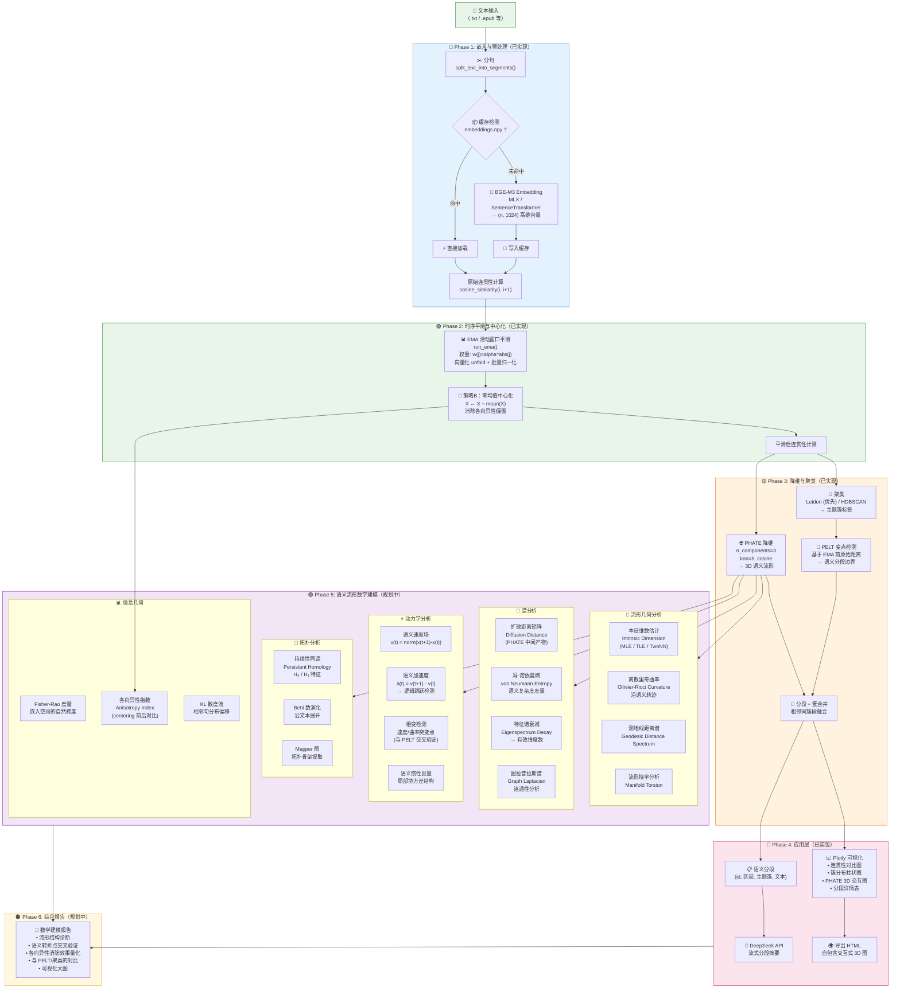

# 语义流形数学建模 — 系统流程图

> 基于 `text_baai_ema_flask_centering.py`（已实现）+ 后续数学建模（规划中）



## 管线说明

### 已实现 (Phase 1–4)

| 阶段 | 核心算法 | 数学原理 |
|------|----------|----------|
| **嵌入** | BGE-M3 (1024-d) | Transformer 最后一层 hidden state |
| **平滑** | EMA + Centering | 指数衰减加权滑动平均 + 零均值去偏 |
| **降维** | PHATE (n_components=3) | 扩散势能距离 + MDS |
| **聚类** | Leiden / HDBSCAN | 模块度优化 / 密度聚类 |
| **分段** | PELT (rbf/l2) | 基于原始 embedding 欧氏距离的变点检测 |

### 规划中 (Phase 5–6)

| 分析维度 | 关键方法 | 解决的问题 |
|----------|----------|------------|
| **本征维数** | MLE / TwoNN | 语义流形的真实自由度 |
| **离散曲率** | Ollivier-Ricci | 文本逻辑转折的几何度量 |
| **冯·诺依曼熵** | 扩散算子的谱熵 | 语义复杂度 / 信息密度 |
| **速度/加速度场** | PHATE 坐标差分 | 叙事节奏与逻辑跳跃的定量描述 |
| **持续性同调** | Ripser / GUDHI | 流形拓扑空洞 (H₁) 检测 |
| **各向异性指数** | Centering 前后对比 | 量化全局偏置去除效果 |
| **Fisher-Rao 度量** | 嵌入空间自然梯度 | 捕捉语义流形的信息几何结构 |

### 关键交叉验证

```
PELT 变点 ←→ 相变检测 (速度/曲率突变)
PELT 变点 ←→ 离散曲率峰值
聚类标签 ←→ 持续性同调 H₀ 连通分量
各向异性指数 ←→ Centering 前后的谱熵变化
轨迹弯曲度 ←→ 测地线/欧氏距离比
```
