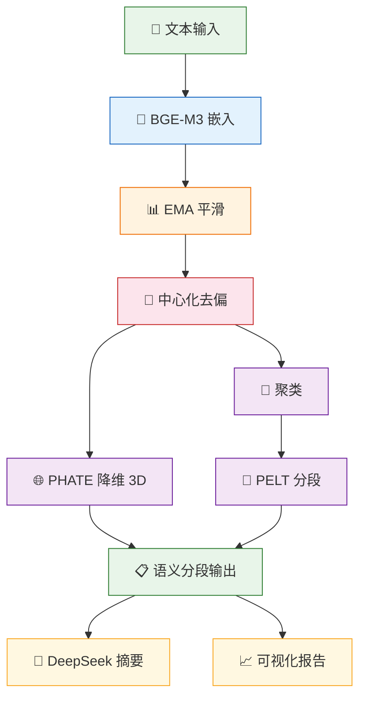
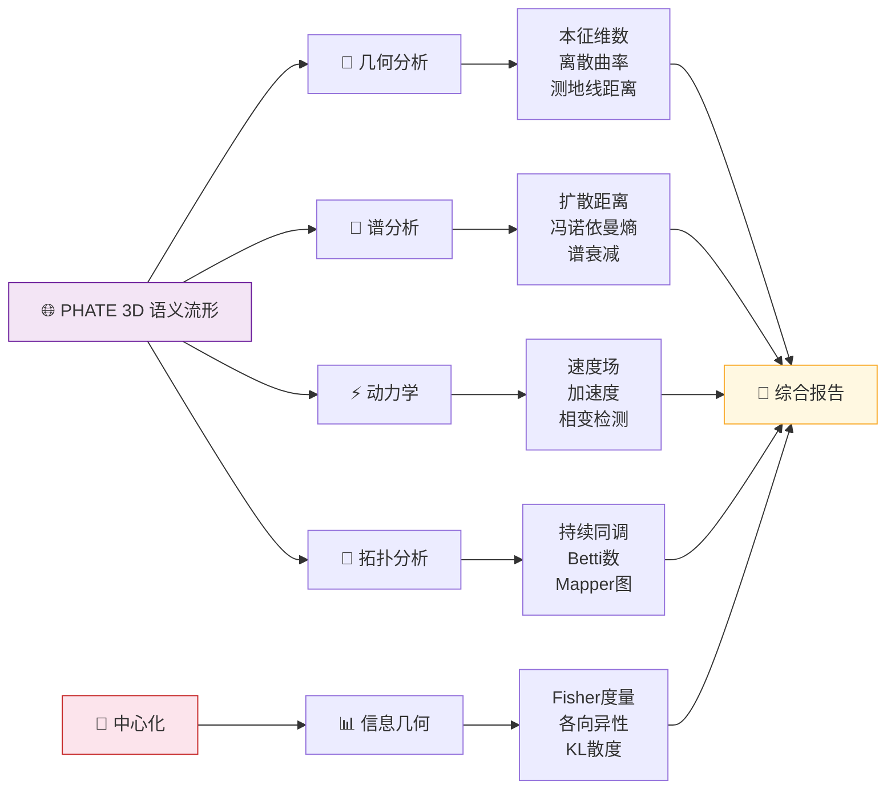
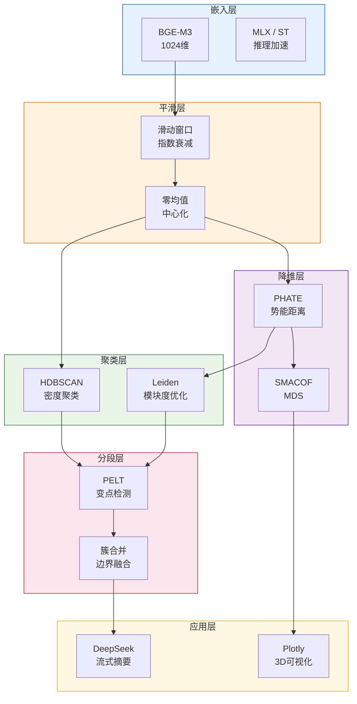

# 语义流形分析管线 — PPT 用图

> 精简版：节点标签 ≤ 8 字，结构拍平，适合 16:9 幻灯片。
> 在 VS Code 中 `Cmd+Shift+V` 预览 → 右键图表 → **Copy as PNG** → 粘贴到 PPT。

## 总览图（单页）



## 数学建模扩展（第二页）



## 技术栈一览（第三页）



---

## 导出到 PPT 的方法

### 方法 1：VS Code 直接复制（推荐）
1. `Cmd+Shift+V` 打开 Markdown 预览
2. 右键 Mermaid 图表 → **Copy as PNG**（或 Copy as SVG）
3. 在 PPT 中 `Cmd+V` 粘贴

### 方法 2：在线导出（备选）
1. 打开 https://mermaid.live
2. 粘贴 Mermaid 代码
3. 点击右上角下载按钮 → PNG / SVG

### 方法 3：命令行导出（最清晰）
```bash
# 需要先装 mermaid-cli（可选）
npm install -g @mermaid-js/mermaid-cli
mmdc -i input.mmd -o output.png -w 1920 -H 1080
```
