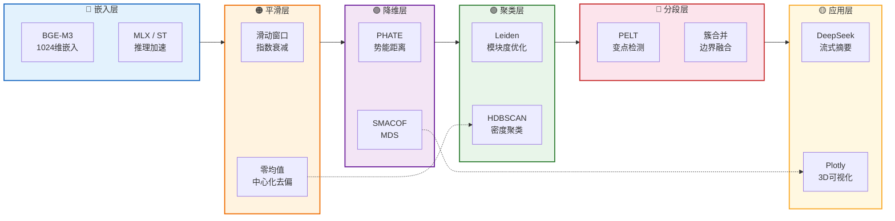

# 技术栈 — 横版（PPT 用）

```mermaid
graph LR
    subgraph L1["🔵 嵌入层"]
        BGE["BGE-M3<br/>1024维嵌入"]
        MLX["MLX / ST<br/>推理加速"]
    end

    subgraph L2["🟠 平滑层"]
        EMA["滑动窗口<br/>指数衰减"]
        CTR["零均值<br/>中心化去偏"]
    end

    subgraph L3["🟣 降维层"]
        PH["PHATE<br/>势能距离"]
        MDS["SMACOF<br/>MDS"]
    end

    subgraph L4["🟢 聚类层"]
        LEI["Leiden<br/>模块度优化"]
        HDB["HDBSCAN<br/>密度聚类"]
    end

    subgraph L5["🔴 分段层"]
        PELT["PELT<br/>变点检测"]
        MRG["簇合并<br/>边界融合"]
    end

    subgraph L6["🟡 应用层"]
        DS["DeepSeek<br/>流式摘要"]
        PLT["Plotly<br/>3D可视化"]
    end

    L1 --> L2 --> L3 --> L4 --> L5 --> L6
    CTR -.-> HDB
    MDS -.-> PLT

    style L1 fill:#e3f2fd,stroke:#1565c0,stroke-width:2px
    style L2 fill:#fff3e0,stroke:#ef6c00,stroke-width:2px
    style L3 fill:#f3e5f5,stroke:#6a1b9a,stroke-width:2px
    style L4 fill:#e8f5e9,stroke:#2e7d32,stroke-width:2px
    style L5 fill:#fce4ec,stroke:#c62828,stroke-width:2px
    style L6 fill:#fff8e1,stroke:#f9a825,stroke-width:2px
```

> 导出：`mmdc -i techstack_horizontal.md -o techstack.png -w 2400 -H 900`
